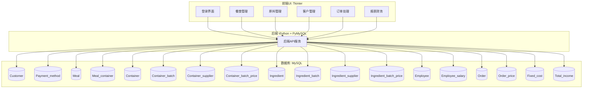

# 工厂后台综合管理系统

一个基于Python Tkinter的食品工厂后台综合管理系统，包含用户登录注册、库存管理、餐食配置、订单管理、客户信息管理和财务管理等功能模块。

## 项目结构

```
Inventory-Management-System/
├── main.py                 # 主启动文件
├── requirements.txt        # 项目依赖
├── README.md              # 项目说明
├── src/                   # 源代码目录
│   ├── system_launcher.py  # 系统启动器
│   ├── login_module.py     # 登录注册模块
│   ├── user_manager.py     # 用户管理类
│   ├── inventory_system.py # 主系统界面
│   ├── inventory_module.py # 库存管理模块
│   ├── meal_module.py      # 餐食配置模块
│   ├── order_module.py     # 订单管理模块
│   ├── customer_module.py  # 客户信息管理模块
│   └── finance_module.py   # 财务管理模块
├── data/                  # 数据文件目录
│   └── users.json         # 用户数据
├── config/                # 配置文件目录
│   └── settings.json      # 系统配置
├── docs/                  # 文档目录
│   ├── README.md          # 详细文档
│   ├── MODULE_ARCHITECTURE.md # 模块架构说明
│   ├── MANAGEMENT_SYSTEM_README.md # 管理系统说明
│   └── QUICK_START.md     # 快速开始指南
└── image/                 # 图片资源目录
    ├── icon/              # 图标文件
    ├── png/               # PNG图片
    └── svg/               # SVG图片
```

## 快速开始

### 1. 环境要求
- Python 3.6+
- Tkinter

### 2. 运行系统
从项目根目录运行：
```bash
python main.py
```

或者从src目录运行：
```bash
cd src
python system_launcher.py
```

### 3. 登录系统
- 使用默认管理员账户：admin / admin@company.com
- 或者注册新用户
- 支持游客模式快速体验

## 功能模块

### 用户系统
- 用户注册登录
- 密码重置
- 游客模式
- 用户信息管理

### 业务模块
1. **库存管理** - 商品库存的增删改查
2. **餐食配置** - 餐食菜单和配置管理
3. **订单管理** - 订单创建、处理和跟踪
4. **客户信息管理** - 客户资料维护
5. **财务管理** - 财务数据统计和分析

## 开发说明

项目采用模块化设计，每个业务功能都是独立的类和文件，便于维护和扩展。

- `src/` - 所有Python源代码
- `data/` - 数据存储文件
- `config/` - 配置文件
- `docs/` - 项目文档
- `image/` - 界面图标和图片资源

## 许可证

MIT License


## 项目详细说明
### 一、项目背景与目标

本项目旨在为一家小型家族经营的食品服务公司开发一套完整的软件系统，提供库存管理、订单追踪、财务预算与客户管理等功能，全面提升其运营效率。采用 Tkinter + MySQL技术栈构建。

### 二、业务需求说明

#### 1. 库存管理

- 管理食材与配送容器的库存数据，包括名称、当前库存、单位、有效期。
- 自动根据客户订单减少相关库存数量。
- 设置安全库存阈值，低于阈值则提示补货。

#### 2. 餐食配置

- 支持自定义至少 5 种可售餐食（Meal），每种餐食需包含所需食材和容器组成。
- 每个餐食价格可设置，且可用于成本核算。

#### 3. 订单管理

- 记录客户订单信息：下单时间、配送时间、订单状态（已接收/进行中/完成）。
- 管理订单明细（每种餐食数量、价格），并生成订单统计。

#### 4. 客户信息管理

- 存储客户姓名、联系方式、地址与支付方式。
- 查询客户历史订单。

#### 5. 财务管理

- 跟踪订单收入与食材/容器成本。
- 固定成本：人力（\$10,000/月）、租金（\$3,500/月）、水电（\$2,000/月）、杂费（\$1,000/月）。
- 支持生成月度利润报表。

### 三、系统架构图



### 四、数据库表结构设计（含主键PK与外键FK标注）

#### Customer 与支付方式

- **Customer**(
  - `PK` customer_id,
  - first_name, last_name, customer_phone, customer_email, customer_address,
  - `FK` payment_method_id)
- **Payment_method**(`PK` payment_method_id, method_name)

#### 餐品与容器

- **Meal**(`PK` meal_id, meal_name, meal_details, meal_price, isActive)
- **Meal_container**(
  - `PK` meal_id + container_id（联合主键）,
  - `FK` meal_id, `FK` container_id,
  - container_required_quantity)
- **Container**(`PK` container_id, container_type, container_unit_cost, container_current_stock, container_reorder_threshold)
- **Container_batch**(
  - `PK` container_batch_id,
  - `FK` container_id, `FK` container_supplier_id, `FK` container_batch_price_id,
  - container_batch_purchase_date)
- **Container_supplier**(`PK` container_supplier_id, container_supplier_name, container_supplier_contact_email, container_supplier_phone, container_supplier_address)
- **Container_batch_price**(`PK` container_batch_price_id, container_batch_price)

#### 员工与薪资

- **Employee**(`PK` employee_id, employee_name, employee_address, `FK` employee_salary_id)
- **Employee_salary**(`PK` employee_salary_id, employee_salary_amount, pay_day)

#### 原料与供货商

- **Ingredient**(`PK` ingredient_id, ingredient_name, ingredient_current_stock, unit_measure, ingredient_reorder_threshold, ingredient_unit_cost)
- **Ingredient_batch**(
  - `PK` ingredient_batch_id,
  - `FK` ingredient_id, `FK` ingredient_batch_price_id, `FK` ingredient_supplier_id,
  - expiration_date, ingredient_purchase_date)
- **Ingredient_supplier**(`PK` ingredient_supplier_id, ingredient_supplier_name, ingredient_supplier_email, ingredient_supplier_phone, ingredient_supplier_address)
- **Ingredient_batch_price**(`PK` ingredient_batch_price_id, ingredient_batch_price)

#### 订单与定价

- **Order**(
  - `PK` order_id,
  - `FK` meal_id, `FK` customer_id, `FK` employee_id, `FK` order_price_id, `FK` payment_method_id,
  - order_date, delivery_date, order_status, order_note)
- **Order_price**(`PK` order_price_id, order_price)

#### 财务与收入

- **Fixed_cost**(`PK` fixed_cost_id, cost_type, effective_date, cost_amount)
- **Total_income**(
  - `PK` total_income_id,
  - `FK` order_price_id, `FK` employee_salary_id, `FK` container_batch_price_id, `FK` ingredient_batch_price_id, `FK` fixed_cost_id)

### 五、前端模块说明（基于 Tkinter）

本系统前端使用 `Tkinter` 实现图形化界面，整体采用**面向对象编程思想**（OOP）。每个模块封装为一个独立类，位于单独的 `.py` 文件中，通过主程序进行模块化引用。所有 UI 设计遵循“**简约、美观、用户友好**”的设计理念，保持统一风格，适配中小企业的使用场景。

#### 项目结构建议

```
frontend/
├── main.py                # 应用入口，启动主窗口
├── login.py               # 登录注册模块类 LoginUI
├── menu.py                # 主菜单模块类 MainMenuUI
├── meal.py                # 餐食管理模块类 MealUI
├── ingredient.py          # 原料管理模块类 IngredientUI
├── container.py           # 容器管理模块类 ContainerUI
├── order.py               # 订单处理模块类 OrderUI
├── customer.py            # 客户管理模块类 CustomerUI
├── employee.py            # 员工管理模块类 EmployeeUI
├── report.py              # 报表与财务模块类 ReportUI
└── utils.py               # 通用工具类（如数据库连接、弹窗提示等）
```

> 所有类遵循封装原则，公开访问使用 getter / setter 方法，并按模块组织成员属性与行为逻辑。

前端系统将以模块化方式组织，采用 `Tkinter` 实现多窗口界面切换与控件交互。每个模块以独立类或窗口呈现，具备以下详细功能与布局建议：

前端基于 Tkinter 实现桌面图形化界面，模块划分明确，功能覆盖库存、订单、客户与财务管理。

#### 1. 登录注册模块（Login / Register）

- **注册功能：**
  - 用户输入姓名、邮箱、电话、密码进行注册。
  - 邮箱需唯一，注册后写入 Customer 表，自动分配 customer_id。
  - 默认支付方式可为空，注册后可由管理员或客户自行添加。
- **登录功能：**
  - 用户通过邮箱 + 密码进行身份验证。
  - 登录后加载对应客户信息并进入主界面。
  - 密码输入框加密显示，登录失败给予明确反馈。
- **登录后跳转：**
  - 普通客户登录后进入订单创建界面。
  - 管理员或员工账户进入管理主界面。
- **安全性建议：**
  - 使用哈希加密存储密码。
  - 注册流程中校验邮箱格式与重复性。

#### 2. 主菜单模块（Main Menu）

- 提供导航按钮进入各业务模块：餐食管理、库存管理、订单管理、客户管理、报表分析。
- 显示系统版本信息与用户欢迎语。

#### 3. 餐食管理模块（MealUI）

- 界面布局：
  - 左侧列表：显示当前所有餐食（meal_id + meal_name）。
  - 中间区域：展示并编辑所选餐食详情（名称、描述、价格、状态）。
  - 下方按钮：新增、保存、删除、配置原料与容器。
- 功能操作：
  - 添加新餐食（支持空白模板填充）。
  - 餐食激活/停用控制（isActive 字段）。
  - 餐食配置窗口：弹出新窗口管理 meal_container 关系，选择容器与需求数量。
  - 自动计算配料总成本与建议售价。
  - 验证重复名称、非法价格等。
- 新增餐食：录入名称、描述、价格、状态。
- 配置餐食组成：选择食材与容器及其数量。
- 编辑/删除餐食信息。
- 查看餐食成本（根据组成计算）。

#### 4. 原料管理模块（IngredientUI）

- 界面布局：
  - 左侧：原料列表（可筛选/搜索）。
  - 右侧：详细信息区域（包括当前库存、安全库存、单位价格、单位）。
  - 下方分页：跳转至批次管理页。
- 功能操作：
  - 添加新原料。
  - 编辑/删除原料属性。
  - 低库存/过期预警图标提示。
  - 查看/录入 Ingredient_batch（采购批次、价格、供应商、有效期）。
  - 自动计算当前总库存与加权平均成本。
- 新增食材信息：名称、单位、初始库存、安全库存、单价。
- 批次管理：添加/查看采购批次与有效期。
- 更新库存：增加/减少库存量。
- 提示即将过期食材。

#### 5. 容器管理子模块

- 添加容器类型、单位成本、安全库存。
- 记录容器采购批次。
- 显示容器当前库存与供应商信息。

#### 6. 订单处理模块（OrderUI）

- 界面布局：
  - 客户选择下拉框（自动读取 customer 表）。
  - 员工选择（默认当前操作人）。
  - 配送日期输入框（支持日历选择）。
  - 餐品选择区：多选列表添加每个 Meal 与数量。
  - 订单详情表格：展示当前订单内容。
  - 底部按钮：保存订单 / 修改状态 / 删除订单。
- 功能操作：
  - 新建订单写入 order 与 order_price 表。
  - 提交订单后自动调用库存接口扣减食材/容器。
  - 订单状态支持切换三种状态，带颜色标签。
  - 查看单个订单的完整履历记录。
- 新建订单：选择客户、员工、配送日期，添加所选餐食及数量。
- 订单状态更新：从“已接收”到“进行中”再到“已完成”。
- 显示订单详情，包括餐食明细与总价。
- 自动关联支付方式并更新库存。

#### 7. 客户管理模块（CustomerUI）

- 新增客户信息：姓名、邮箱、电话、地址、支付方式。
- 编辑客户资料。
- 查询客户历史订单列表与详情。

#### 8. 员工管理子模块（可扩展）

- 录入员工信息与月薪。
- 显示员工参与的订单履历。

#### 9. 报表与财务模块（ReportUI）

- 收入汇总：按月展示订单收入与客户贡献。
- 成本明细：显示容器/食材采购、员工工资、固定费用。
- 利润分析：计算净收入 = 收入 - 成本。
- 导出报表（CSV/Excel）。

#### 10. 通用功能

- 弹窗提示与错误处理。
- 所有表单输入校验。
- 所有数据可通过界面刷新与查询。
- 简洁直观 UI 设计，适配小团队使用。
