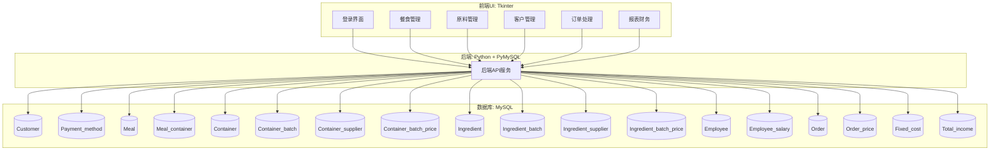

# 项目文档：小型食品服务公司的库存、订单与预算管理系统

## 一、项目背景与目标

本项目旨在为一家小型家族经营的食品服务公司开发一套完整的软件系统，提供库存管理、订单追踪、财务预算与客户管理等功能，全面提升其运营效率。采用 Tkinter + MySQL技术栈构建。

## 二、业务需求说明

### 1. 库存管理

- 管理食材与配送容器的库存数据，包括名称、当前库存、单位、有效期。
- 自动根据客户订单减少相关库存数量。
- 设置安全库存阈值，低于阈值则提示补货。

### 2. 餐食配置

- 支持自定义至少 5 种可售餐食（Meal），每种餐食需包含所需食材和容器组成。
- 每个餐食价格可设置，且可用于成本核算。

### 3. 订单管理

- 记录客户订单信息：下单时间、配送时间、订单状态（已接收/进行中/完成）。
- 管理订单明细（每种餐食数量、价格），并生成订单统计。

### 4. 客户信息管理

- 存储客户姓名、联系方式、地址与支付方式。
- 查询客户历史订单。

### 5. 财务管理

- 跟踪订单收入与食材/容器成本。
- 固定成本：人力（\$10,000/月）、租金（\$3,500/月）、水电（\$2,000/月）、杂费（\$1,000/月）。
- 支持生成月度利润报表。

## 三、系统架构图

## 四、数据库表结构设计（含主键PK与外键FK标注）

### Customer 与支付方式

- **Customer**(
  - `PK` customer\_id,
  - first\_name, last\_name, customer\_phone, customer\_email, customer\_address,
  - `FK` payment\_method\_id)
- **Payment\_method**(`PK` payment\_method\_id, method\_name)

### 餐品与容器

- **Meal**(`PK` meal\_id, meal\_name, meal\_details, meal\_price, isActive)
- **Meal\_container**(
  - `PK` meal\_id + container\_id（联合主键）,
  - `FK` meal\_id, `FK` container\_id,
  - container\_required\_quantity)
- **Container**(`PK` container\_id, container\_type, container\_unit\_cost, container\_current\_stock, container\_reorder\_threshold)
- **Container\_batch**(
  - `PK` container\_batch\_id,
  - `FK` container\_id, `FK` container\_supplier\_id, `FK` container\_batch\_price\_id,
  - container\_batch\_purchase\_date)
- **Container\_supplier**(`PK` container\_supplier\_id, container\_supplier\_name, container\_supplier\_contact\_email, container\_supplier\_phone, container\_supplier\_address)
- **Container\_batch\_price**(`PK` container\_batch\_price\_id, container\_batch\_price)

### 员工与薪资

- **Employee**(`PK` employee\_id, employee\_name, employee\_address, `FK` employee\_salary\_id)
- **Employee\_salary**(`PK` employee\_salary\_id, employee\_salary\_amount, pay\_day)

### 原料与供货商

- **Ingredient**(`PK` ingredient\_id, ingredient\_name, ingredient\_current\_stock, unit\_measure, ingredient\_reorder\_threshold, ingredient\_unit\_cost)
- **Ingredient\_batch**(
  - `PK` ingredient\_batch\_id,
  - `FK` ingredient\_id, `FK` ingredient\_batch\_price\_id, `FK` ingredient\_supplier\_id,
  - expiration\_date, ingredient\_purchase\_date)
- **Ingredient\_supplier**(`PK` ingredient\_supplier\_id, ingredient\_supplier\_name, ingredient\_supplier\_email, ingredient\_supplier\_phone, ingredient\_supplier\_address)
- **Ingredient\_batch\_price**(`PK` ingredient\_batch\_price\_id, ingredient\_batch\_price)

### 订单与定价

- **Order**(
  - `PK` order\_id,
  - `FK` meal\_id, `FK` customer\_id, `FK` employee\_id, `FK` order\_price\_id, `FK` payment\_method\_id,
  - order\_date, delivery\_date, order\_status, order\_note)
- **Order\_price**(`PK` order\_price\_id, order\_price)

### 财务与收入

- **Fixed\_cost**(`PK` fixed\_cost\_id, cost\_type, effective\_date, cost\_amount)
- **Total\_income**(
  - `PK` total\_income\_id,
  - `FK` order\_price\_id, `FK` employee\_salary\_id, `FK` container\_batch\_price\_id, `FK` ingredient\_batch\_price\_id, `FK` fixed\_cost\_id)

## 五、前端模块说明（基于 Tkinter）

- **登录模块**：基础认证与主界面入口。
- **餐食管理模块**：支持创建、修改、删除 Meal 信息。
- **原料管理模块**：录入与更新 Ingredient 信息及其批次。
- **订单管理模块**：客户下单、订单状态更新、明细显示。
- **客户信息模块**：客户新增与历史订单追踪。
- **报表模块**：月度收入、成本、利润可视化展示。

