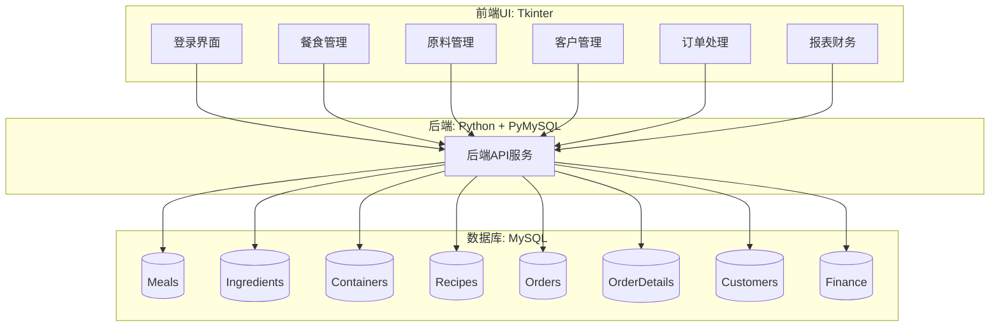

# 项目文档：小型食品服务公司的库存、订单与预算管理系统

## 一、项目背景与目标

为一家小型家族食品服务公司开发一套桌面软件系统，目标如下：

- **库存管理**：跟踪食材与包装容器的库存及有效期，支持自动库存更新。
- **订单跟踪**：管理客户订单，跟踪订单状态并生成相关报表。
- **预算管理**：记录收入、支出（固定和变动），分析利润情况。
- **客户管理**：维护客户信息并跟踪其历史订单。
- **系统集成**：系统前端使用 Python 的 Tkinter 开发，后端采用 MySQL 数据库，借助 PyMySQL 实现数据操作。

## 二、业务需求

### 1. 用餐产品定义与库存管理

- 至少提供 **五种可购餐食 (Meal)**。
- 每种餐食对应定量 **原材料 (Ingredients)** 和 **配送容器 (Containers)**。
- 必须记录 **库存数量** 和 **有效期 (Expiration Date)**。
- 餐食一约完成订单，自动减少对应库存。
- 系统应计算并记录 **单位成本 (COGS)**。

### 2. 订单管理

- 订单包括：客户、餐食明细、数量、配送日期。
- 订单状态包括：“已接收”，“进行中”，“已完成”等。
- 支持：
  - 历史订单查询
  - 生成订单报表
  - 自动扩减库存

### 3. 预算与财务管理

- 收入来源：客户订单
- 变动成本：COGS
- 固定成本（每月）：
  - 人力：\$10,000
  - 租金：\$3,500
  - 水电：\$2,000
  - 管理费：\$1,000
- 支持月度收支、利润统计

### 4. 客户管理

- 存储姓名、地址、联系方式
- 跟踪历史订单

## 三、系统架构图

## 四、数据表结构

- **Meals**(meal\_id, name, description, price, cost)
- **Ingredients**(ingredient\_id, name, quantity\_in\_stock, unit, expiration\_date)
- **Containers**(container\_id, name, quantity\_in\_stock, expiration\_date)
- **Recipes**(recipe\_id, meal\_id, ingredient\_id, quantity\_required)
- **Orders**(order\_id, customer\_id, order\_date, delivery\_date, status)
- **OrderDetails**(order\_detail\_id, order\_id, meal\_id, quantity)
- **Customers**(customer\_id, name, email, phone, address)
- **Finance**(finance\_id, month, total\_income, total\_COGS, fixed\_expenses, net\_profit)

## 五、前端模块 (Tkinter)

- 主界面 / 登录
- 餐食管理
- 原料管理
- 客户管理
- 订单创建与状态更新
- 收支报表查询

